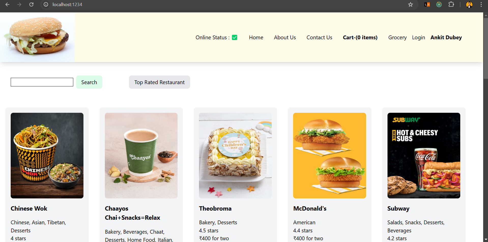
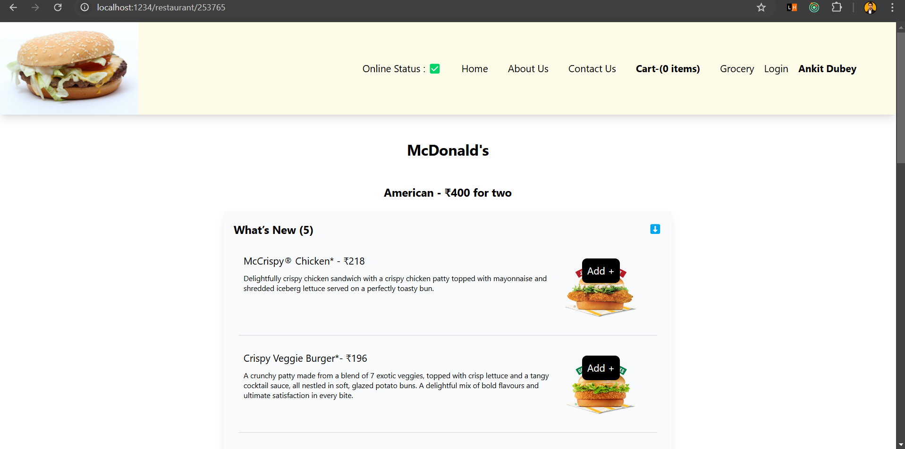
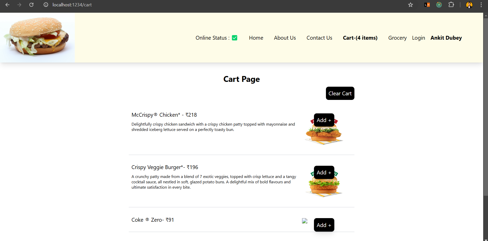

# Food Ordering App

Welcome to the Food Ordering App project!

- Developed interactive restaurant listings using ReactJS, streamlined user navigation and increased page load speed, utilized Swiggy API to fetch real-time data.
- Designed and implemented a real-time order management system with Redux for efficient state management.
- Improved application performance through code splitting and lazy loading, resulting in faster load times and smoother user experience.

## Tech Used

- **Frontend**: React, Tailwind CSS

## Screenshots

_Home Page_

_Items_

_Cart_

